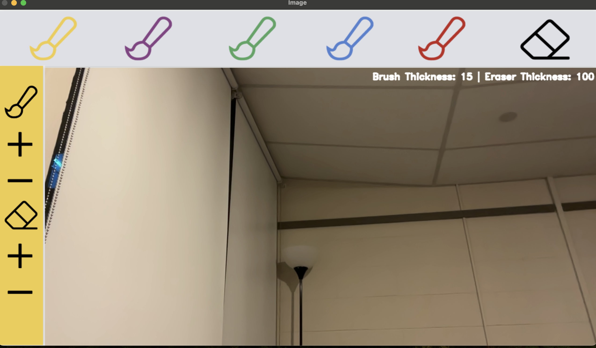
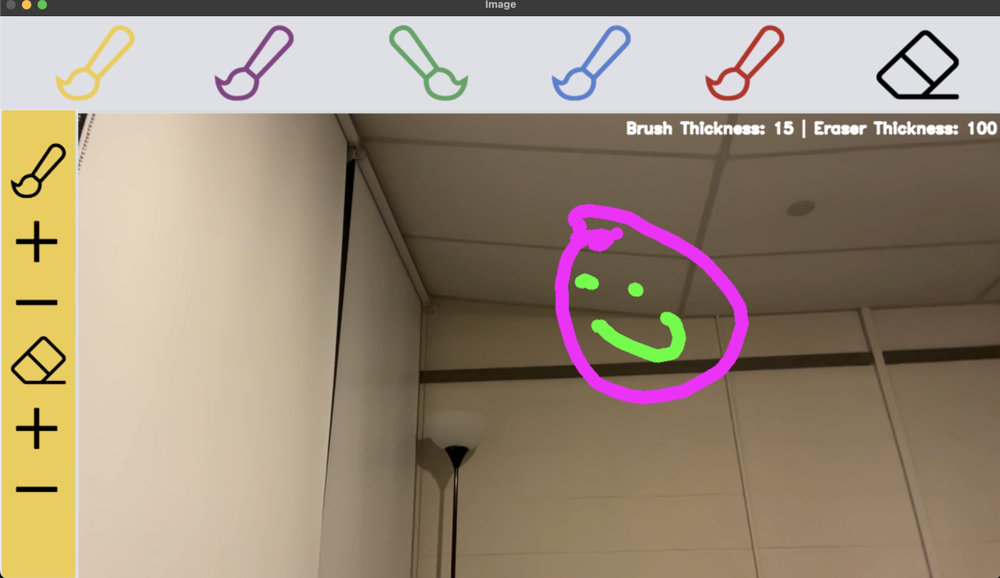

# Hand_Painter

An application that allows you to paint in realtime using your webcams video and just your hands.

When running this program, you will end up with a screen like this (hopefully with your face in i!):


On first start, the default color will always be yellow. To start drawing, you can simply point your index finger and just let it flow. Wherever your index finger is pointing is where it starts drawing. Your index finger will have a circle which will be the same color as your selected brush. To change brush color, or change to eraser, hold your index and middle finger up (like a peace sign) and navigate to the top of the screen and simply hover over where the brushes/eraser are. When holding those two fingers up, you will see a rectangle that tracks those fingers. After selecting, the header will change and now, the circle/rectangle on your hand will also change color.

To change thickness, hold up three fingers (index, middle and ring) and navigate to the sidebar where you see the plus and minus signs. Simply hover over them, and you can see on the text in the top right, your thickness updating. To exit the screen, simply press `Esc`

With this, you can make drawings like this:


Although please, make it better than mine. I am not a good artist. I made this for my brother who likes drawing.

## Dependencies

In order for the project to compile, you will have to install the dependencies `OpenCv` which is required for the actual showing of the image, and `MediaPipe` for the actual tracking of your hands. You can install both of them via these commands:

```
pip install opencv-python
pip install mediapipe
```

For these to run, you will need to run it on a Python Interpreter or a virtual environment like I did (for this, you can use Anaconda)

## Run

In order to run the program, you can simply run the program `VirtualPaint.py`.

## TODOS

- One thing to fix is that for increasing brush thickness and eraser thickness, I need to find a smoother approach to increase it as right now, it increaes rapidly
